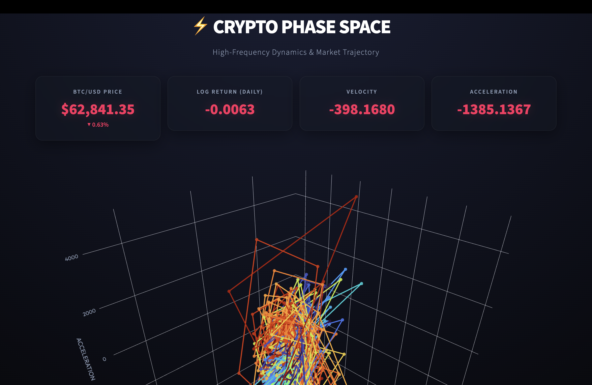

# ⚡ Crypto Phase Space Analyzer - HFT Dashboard

A sleek, High-Frequency Trading (HFT) style web dashboard that visualizes the dynamics of the cryptocurrency market (BTC) in an interactive 3D phase space. Built with Python, Streamlit, and Plotly.



## Features

- **Interactive 3D Trajectory**: Real-time interactive Plotly 3D scatter/line chart mapping Log Returns, Velocity, and Acceleration.
- **Premium HFT Aesthetics**: A beautiful dark-mode glassmorphism UI with glowing neon metrics for price, velocity, and acceleration.
- **Data Caching**: Instantly loads 5 years of historical BTC data without redundant API calls to Yahoo Finance.
- **Responsive Layout**: Adapts perfectly to your browser window for an immersive terminal experience.

## Getting Started

1. Clone the repository to your local machine:
   ```bash
   git clone https://github.com/alwaysprince05/Crypto-Phase-Space-Analyzer.git
   cd Crypto-Phase-Space-Analyzer
   ```

2. Set up a virtual environment (optional but recommended):
   ```bash
   python3 -m venv venv
   source venv/bin/activate
   ```

3. Install dependencies:
   ```bash
   pip install -r requirements.txt
   ```

4. Run the visualization:
   ```bash
   python main.py
   ```
   *(This will automatically launch the Streamlit web dashboard in your browser!)*

## Project Structure
- `app.py`: Streamlit web application and UI layout.
- `main.py`: Launcher script.
- `data_loader.py`: Downloads and processes BTC price data using `yfinance`.
- `state_space.py`: Computes phase space mathematical coordinates.
- `requirements.txt`: Python dependencies.

## Creator/Dev: alwaysprince05
